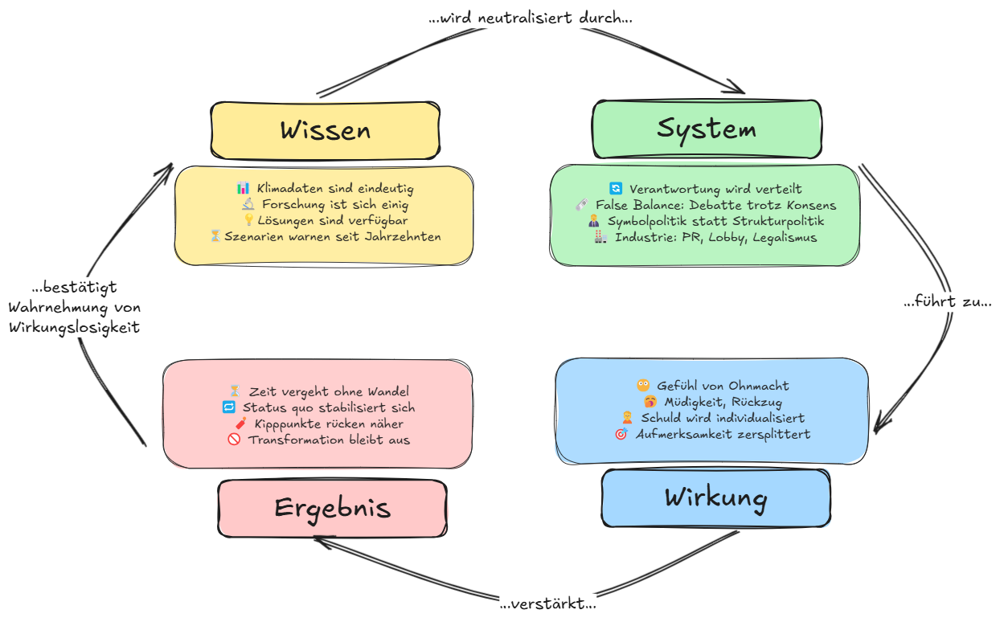

# Kapitel 3 – Warum Wissen nicht reicht

## 🧠 Wissen ist da – Wirkung bleibt aus

Die Daten sind klar. Die Modelle präzise. Die Prognosen erschreckend konstant.

**Seit 1990 – dem Zeitpunkt eines breiten wissenschaftlichen Konsenses über die menschengemachte Erderwärmung – wurden rund 56 % aller fossilen CO₂-Emissionen seit 1750 ausgestoßen. Rechnet man zusätzlich die Emissionen aus Landnutzungsänderungen hinzu, liegt der Anteil bei etwa 45 % aller anthropogenen CO₂-Emissionen seit Beginn der Industrialisierung.**[^warum1] Die Klimakrise ist also kein Ergebnis von Unwissen – sondern von unterlassener Umsetzung.

Trotzdem steigt der Ausstoß. Der Wandel bleibt aus.

> _Was fehlt, ist nicht Wissen – sondern Wirkung._

_Abb. 1: Das System der Verzögerung – Wissen verpufft, weil es systematisch neutralisiert wird._

Was uns bremst, ist kein Mangel an Fakten – sondern ein Zusammenspiel aus:

- **verteilter Verantwortung**
- **rollenbasierter Ablenkung**
- **institutioneller Trägheit**

## 🪢 Das System der Verzögerung – kompakt

> 📌 **Kontext**:\
> Die Aussage „Verzögerung ist System“ wird hier konkretisiert – durch ein strukturiertes Zusammenspiel aus Akteuren, Mechanismen und Verzögerungsmustern, das nicht zufällig wirkt, sondern systemisch.

| 🧠 **Wissen ist da**                 | 🕸️ **Aber das System…**                          | 🪤 **…führt zu**                   | ⏳ **Und das Ergebnis ist**         |
| ------------------------------------ | ------------------------------------------------ | ---------------------------------- | ----------------------------------- |
| ✅ Klimadaten sind eindeutig         | 🔄 Verantwortung wird verteilt oder verschleiert | 😶 Gefühl von Ohnmacht             | 🧨 Handlung bleibt aus              |
| ✅ Forschung ist sich einig          | 🗞️ Medien inszenieren Debatten                   | 🎯 Aufmerksamkeit wird abgelenkt   | ⏳ Zeit vergeht – ohne Wirkung      |
| ✅ Lösungen sind bekannt             | 🧑‍💼 Politik setzt auf Symbolik statt Struktur     | 🙍 Schuld wird individualisiert    | 🔁 Der Status quo stabilisiert sich |
| ✅ Szenarien warnen seit Jahrzehnten | 🏭 Industrie verzögert gezielt (PR, Lobby etc.)  | 🥱 Müdigkeit, Rückzug, Resignation | 🚨 Kipppunkte rücken näher          |

## 📌 Was daraus folgt

- Dieses System braucht keine Lüge – **nur Lücken**.
- Verzögerung ist kein Betriebsfehler – sondern **Systemarchitektur**.
- **Wer das Muster erkennt, erkennt auch seine Bruchstellen.**

---

> _„Die Schlinge wirkt, weil niemand sie unterbricht.“_

[^warum1]: Friedlingstein, P., Jones, M. W., O’Sullivan, M., Andrew, R. M., Bakker, D. C. E., Canadell, J. G., et al. (2023). Global Carbon Budget 2023. _Earth System Science Data_, 15, 5301–5334. [https://doi.org/10.5194/essd-15-5301-2023](https://doi.org/10.5194/essd-15-5301-2023). Berechnung auf Basis des Supplement-Datensatzes („Historical Budget“, Version 1.1, Sheet „global_annual“): Von den insgesamt 1773 Gt fossilen CO₂-Emissionen seit 1750 wurden 988 Gt (56 %) nach 1990 ausgestoßen. Unter Einbezug der Emissionen aus Landnutzung (LULUCF) beträgt der Anteil nach 1990 rund 45 % (1159 von 2575 Gt CO₂).

<Footer />
