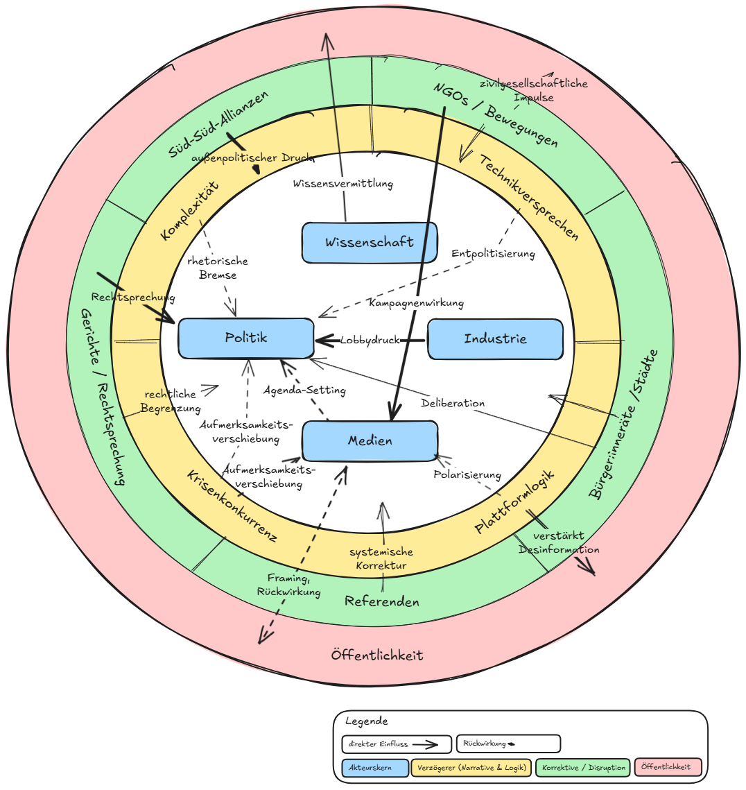

# Kapitel 6 – Schlüssel­ebenen

Die Klimakrise ist kein rein technisches Problem.\
Sie ist ein komplexes Geflecht aus Wissen, Macht, Routinen – **ein systemisches Phänomen**, das sich nicht mit Fakten allein bewältigen lässt.

## 🎯 Worum es in diesem Kapitel geht

Diese Einführung skizziert die **zentralen gesellschaftlichen, politischen und kommunikativen Ebenen**,\
auf denen Klimawissen entsteht – aber auch in Spannung zu anderen Interessen steht.

Es geht nicht um Schuld, sondern um **Strukturen, Verantwortung und Handlungsspielräume**:

- Wer wusste wann – und wie wurde mit diesem Wissen umgegangen?
- Welche Rolle spielen Medien, Märkte, Institutionen und gesellschaftliche Narrative?
- Wo wird gehandelt – und wo bestehen Muster des Zögerns?

## 🧩 Der systemische Blick

Jede dieser **Schlüsselebenen** wird in einem eigenen Kapitel vertieft.\
Gemeinsam zeigen sie, **wie Klimaverzögerung strukturell verankert ist – und wo Möglichkeiten für Veränderung liegen.**

> **„Verzögerung ist kein Zufall – sie folgt Mustern.“**

Dieses Dossier macht diese Muster sichtbar –\
und lädt dazu ein, Räume für Wandel gezielt zu erkennen und zu nutzen.

## 🗺️ Systemkarte: Akteure, Dynamiken, Ebenen

_Überblick zu Kapitel 6: Wissenschaft, Industrie, Politik, Medien, Öffentlichkeit – und ihre Wechselwirkungen._

**So liest man die Grafik:**

- **Kreise** zeigen die Ebenen:
  - 🔵 Kernakteure (Wissenschaft, Industrie…)
  - 🟡 systemische Verzögerungsfaktoren
  - 🟢 mögliche Korrektive (Gerichte, NGOs…)
  - 🔴 Öffentlichkeit (wirkt reaktiv, resonanzabhängig)
- **Pfeile** markieren Einflussrichtungen:
  - **stark & solide** = direkter Macht-Einfluss (z. B. Lobby)
  - **gestrichelt** = indirekte oder systemische Wirkung
  - **dünn** = Rückkopplungen (z. B. Framing, Polarisierung)

Diese Visualisierung kann beim Lesen der folgenden Unterkapitel als Landkarte dienen.

<Footer />
