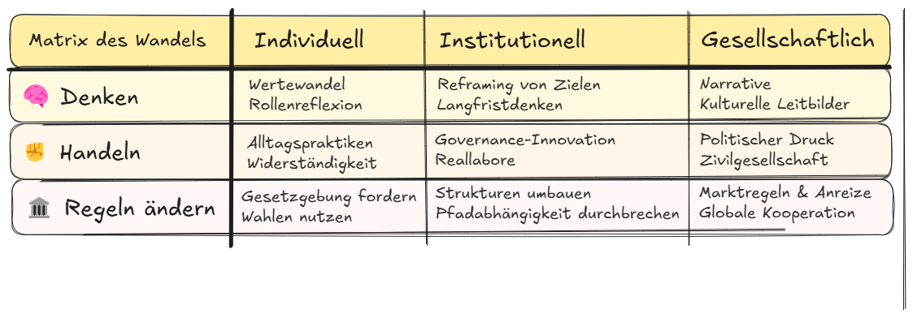

# 7.3 Systemwechsel konkret – 9 Hebel auf 3 Ebenen

Dieses Kapitel zeigt, wie Gesetze, Verträge und Regeln verändert werden müssen –\
damit Klimaschutz nicht von Einsicht abhängt, sondern vom System selbst.

## 🧭 Der Systemwechsel beginnt nicht mit Einsicht, sondern mit Architektur

Ein System kippt nicht durch Kritik.\
Es kippt, wenn es sich selbst widerspricht.

Was wäre, wenn die Regeln den Planeten schützten – ganz automatisch?\
Wenn kein Gesetz mehr durchkäme, das uns zurück ins Fossile zieht?

Dieses Kapitel zeigt, wie Macht neu geordnet werden kann – und Blockaden enden.\
**Drei Maßstabsebenen. Neun Eingriffe. Kein Appell. Eine Anleitung.**

## 🧭 Matrix des Wandels

_Ein Raster aus Denken, Handeln und Regeln – auf drei Wirkungsebenen. Lesbar als Kompass für Systemwechsel._

## 🌍 INTERNATIONALE EBENE – Wenn Verträge Fesseln sind

### 1. Klimavorbehalt in allen Handelsverträgen

**Was:**\
Jeder neue Handelsvertrag enthält eine Klausel: **Klimaschutz hat Vorrang vor Investoreninteressen.**

**Wie:**\
Verankerung auf Basis des Pariser Abkommens (Klimazielvertrag von 2015). WTO-kompatible Klimaausnahmen im Vertragsrecht.

**Fiktionale Szene:**\
_2029, Den Haag._ Zwei Männer vor Gericht – einer vertritt ein Bergwerk, der andere einen Gletscher.\
Die Richterin sagt:

> „Klimaziele sind kein Anhang. Sie sind Verfassungsgrund.“

### 2. Investorenschutz neu schreiben

**Was:**\
Unternehmen dürfen Staaten **nicht mehr** für Klimaschutzmaßnahmen verklagen.

**Wie:**\
ISDS-Klauseln (Investor-Staat-Schiedsverfahren) streichen – oder ersetzen durch öffentliche Schiedsgerichte mit Klimaschutzklausel.

**Fiktionale Szene:**\
Ein kanadischer Konzern fordert Entschädigung für den Kohleausstieg. Das Gericht urteilt:

> „Die Zukunft ist kein Geschäftsrisiko.“

### 3. CO₂-Grenzen an der Zollschranke

**Was:**\
Importe aus klimaschädlicher Produktion werden teurer.\
Klimakompatible Staaten erhalten Vorteile.

**Wie:**\
Ein CO₂-Grenzausgleich (CBAM) wird kombiniert mit Pariser Kompatibilität als Handelsvoraussetzung.

**Fiktionale Szene:**\
Eine indische Stahlfabrik investiert in grüne Technik – nicht aus Überzeugung, sondern weil der Markt es verlangt.

## 🏛️ NATIONALE EBENE – Gesetze, die nicht mehr lügen können

### 4. Klimawirkungsprüfung mit Vetopflicht

**Was:**\
Jedes Gesetz braucht eine CO₂-Bilanz.\
Verfehlt es den Klimapfad, wird es automatisch gestoppt.

**Wie:**\
Verpflichtend im Klimaschutzgesetz und in der Parlamentsordnung. Prüfung durch ein unabhängiges Gremium.

**Fiktionale Szene:**\
Ein Bonus für Plug-in-Hybride wird beschlossen.\
Der Bericht zeigt: +1,2 % Emissionen.\
Der Klimarat sagt Nein. Der Bundestag schweigt. Das Gesetz fällt.

### 5. CO₂-Preis mit Dividende – gesetzlich fixiert

**Was:**\
Der CO₂-Preis steigt automatisch.\
Die Einnahmen werden pro Kopf an die Bevölkerung zurückgezahlt.

**Wie:**\
Gesetzlich indexierter Preisanstieg. Rückzahlung über die Finanzämter.

**Fiktionale Szene:**\
2027. Heizöl wird teurer – gleichzeitig erhalten alle Haushalte 1.000 € zurück.\
Der Effekt: Klimaschutz rechnet sich – sozial gerecht.

### 6. Keine Subvention ohne Klimatreue

**Was:**\
Staatliche Gelder fließen **nur** in Projekte, die mit dem 1,5°-Ziel vereinbar sind.

**Wie:**\
Klimakriterien im Haushaltsrecht und bei Vergabeverfahren verbindlich verankern.

**Fiktionale Szene:**\
Ein Flughafenausbau soll gefördert werden –\
bis der Haushaltsausschuss sagt: „Nicht auf diesem Pfad.“

## 🏘️ KOMMUNALE EBENE – Macht, die nah ist

### 7. CO₂-Budgets in Bürger:innenhand

**Was:**\
Jede Kommune erhält ein jährliches CO₂-Limit.\
Großprojekte werden gemeinsam mit Bürger:innen priorisiert.

**Wie:**\
Verpflichtende Bürgerräte plus gesetzlich verankerte Pfadbindung auf Landesebene.

**Fiktionale Szene:**\
Stadtrat Freiburg. Zwei Projekte konkurrieren: Parkdeck oder Wärmenetz.\
Die Losgruppe entscheidet: Klimaschutz zuerst.

### 8. Klimaprüfung für Baupolitik

**Was:**\
Jede neue Straße, jedes neue Wohngebiet braucht eine CO₂-Wirkungsprüfung.

**Wie:**\
Bauleitplanung wird um Klimakriterien erweitert.\
Integration in bestehende Umweltprüfungen.

**Fiktionale Szene:**\
Ein Neubaugebiet wird nicht genehmigt – nicht wegen der Kosten.\
Sondern wegen der Klimabilanz.

### 9. Geld nur für Kommunen mit Pfadtreue

**Was:**\
Fördermittel werden an tatsächliche CO₂-Einsparungen geknüpft.

**Wie:**\
Transformationsfonds mit klarer Pfadbindung auf Landes- und Bundesebene.

**Fiktionale Szene:**\
Zwei Städte: Eine hat 60 % eingespart – sie bekommt 40 Millionen.\
Die andere: nichts. Kein Skandal. Nur Konsequenz.

## 📉 Machtmatrix

| **Ebene**     | **Vorschlag**                 | **Wirkung** | **Mehrheit** | **Rückbausicherheit** |
| ------------- | ----------------------------- | ----------- | ------------ | --------------------- |
| International | Klimavorbehalt                | Hoch        | Teilweise    | Hoch                  |
| International | ISDS-Reform                   | Mittel      | Schwach      | Mittel                |
| International | CO₂-Zölle                     | Hoch        | Ja           | Hoch                  |
| National      | Klimawirkungsprüfung          | Hoch        | Ja           | Hoch                  |
| National      | CO₂-Preis + Dividende         | Hoch        | Ja           | Hoch                  |
| National      | Klimaklausel für Subventionen | Mittel      | Ja           | Ja                    |
| Kommunal      | Budgets + Beteiligung         | Hoch        | Ja           | Mittel                |
| Kommunal      | Bau-Klimaprüfung              | Mittel      | Ja           | Hoch                  |
| Kommunal      | Förderbindung an CO₂-Pfad     | Hoch        | Ja           | Hoch                  |

## 🔄 Verbindung zu "Gegenmacht"

Nicht alle Hebel dieses Kapitels liegen in den Händen der Leser:innen.\
Aber ihre Durchsetzung beginnt oft ganz woanders.

> Wer national keine Macht hat, kann lokal Druck aufbauen – mit Öffentlichkeit, Klage, Protest.\
> Der Werkzeugkasten zeigt: Manche Hebel sind institutionell – aber ihre Bruchstellen liegen im Alltag.

## 🧰 Handlungsmatrix für Alltag und Akteure

| **Wirkfel**          | **Was kann ich konkret tun?**                                               |
| -------------------- | --------------------------------------------------------------------------- |
| **Kommune**          | Bürgerrat anstoßen, Klimavorbehalt in Bauleitlinien fordern                 |
| **NGO / Bündnis**    | Koalition für ein CO₂-gebundenes Fördergesetz gründen                       |
| **Bildung / Schule** | „Zukunftsgericht“ simulieren, Klimaverfassungen debattieren                 |
| **Medien / Kultur**  | Investorenschutz visualisieren, Rückbau dokumentieren, Machtfragen erzählen |

## 🧩 Struktur statt Einsicht

> Die neun Eingriffe verändern nicht nur Inhalte – sondern Prozesse.\
> Sie verlagern die Verantwortung vom Gewissen zur Architektur.

Ein gutes Gesetz erkennt man daran, dass es **nicht verstanden werden muss, um zu wirken**.

**Wenn Regeln Automatik erzeugen, braucht es keine Empörung mehr.**\
**Dann genügt der Ablauf.**

> Das ist keine Utopie – sondern Rechtsgestaltung im Ernstfall.

## 🔚 Letzter Satz

> Dieses Gesetz fällt nicht wegen Empörung – sondern weil es am Pfad scheitert.\
> Wenn Architektur wirkt, braucht es keine Einsicht mehr.\
> Bruchstellen lassen sich bauen.\
> Wer das Recht ändert, ändert das Ergebnis.\
> **Systemwandel ist kein Traum. Er ist eine Entscheidung über Regeln.**

<Footer />
