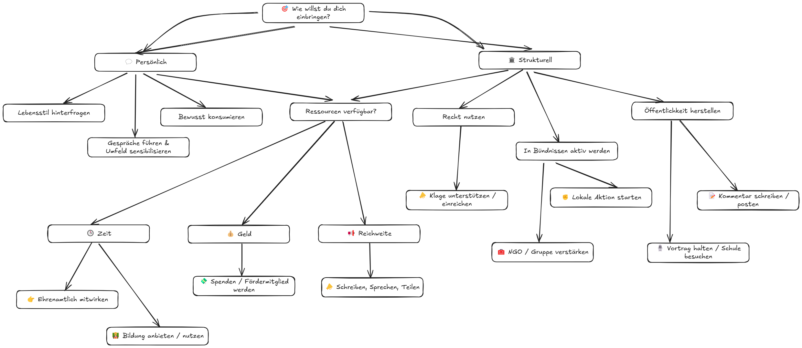

# 8.4 Handlungsraster – konkret, machbar, wirksam

> Wirkung beginnt nicht mit der perfekten Antwort, sondern mit der nächsten Handlung.

Dieses Raster zeigt: Klimaschutz geht im Kleinen los – im Alltag, im Beruf, digital oder gemeinsam mit anderen. Die Tabelle hilft dabei, erste Schritte zu planen – nach Lebensbereich, geschätztem Aufwand und möglicher Wirkung.

| **Bereich**    | **Handlungsmöglichkeit**                                                                | **Aufwand** | **Wirkung** | **Quelle**                                                                                  |
| -------------- | --------------------------------------------------------------------------------------- | ----------- | ----------- | ------------------------------------------------------------------------------------------- |
| 🏠 Privat      | Stromanbieter auf Ökostrom umstellen                                                    | Mittel      | Hoch        | Verivox [verivox.de/stromvergleich](https://www.verivox.de/stromvergleich/)                 |
|                | Konto zu einer ethisch-nachhaltigen Bank wechseln                                       | Mittel      | Hoch        | UmweltBank [umweltbank.de](https://www.umweltbank.de/)                                      |
|                | Kleidung reparieren oder tauschen statt neu kaufen                                      | Gering      | Mittel      | [Repair Café](https://repaircafe.org/de/)                                                   |
|                | Streamingzeit bewusst reduzieren                                                        | Gering      | Mittel      | Öko-Institut [oeko.de](https://www.oeko.de/fileadmin/oekodoc/Streaming-und-Klimaschutz.pdf) |
| 🧑‍🏫 Beruflich   | An einer Klimaschutz-Fortbildung teilnehmen                                             | Hoch        | Hoch        | oekojobs [oekojobs.de](https://oekojobs.de/)                                                |
|                | Dienstreisen überdenken – wenn möglich: Bahn statt Flug                                 | Gering      | Mittel      | Bahn.de [bahn.de](https://www.bahn.de)                                                      |
|                | Nachhaltige Beschaffung im Team oder Betrieb anregen                                    | Mittel      | Hoch        | [Green Procurement Leitfäden]                                                               |
| 🌐 Digital     | Green Hosting nutzen, Streaming begrenzen, Klimahinweis in Mails                        | Gering      | Mittel      | Green Web Foundation [thegreenwebfoundation.org](https://www.thegreenwebfoundation.org)     |
|                | Startseite im Browser auf seriöse Klimainfos stellen                                    | Gering      | Mittel      | [klimafakten.de](https://www.klimafakten.de/)                                               |
| 🧑‍🤝‍🧑 Kollektiv   | Eine Aktion mit Nachbar:innen oder im Quartier starten                                  | Gering      | Mittel      | Balkon-Aktion, Klimadialog (lokale Beispiele)                                               |
|                | Verein oder Gruppe gründen – oder eine bestehende verstärken                            | Mittel      | Hoch        | Klimacamp [klimacamp.eu](https://klimacamp.eu)                                              |
|                | Politische oder juristische Klimaforderungen mit Verweis auf IGH-Gutachten unterstützen | Gering      | Mittel–Hoch | ICJ (2025): [icj-cij.org/case/187](https://www.icj-cij.org/case/187)                        |
| 👶 Sorgearbeit | Kita-Essen mitgestalten, Elternrat stärken                                              | Mittel      | Mittel      | Elterninitiativen, VCD [vcd.org](https://www.vcd.org)                                       |
|                | Kinderfragen zum Klima ernst nehmen und gemeinsam recherchieren                         | Gering      | Hoch        | [Sendung mit der Maus – Klima](https://www.wdrmaus.de/extras/klima/)                        |
| 👴 Ruhestand   | Stiftung oder Spenden neu ausrichten, Zeit mit Enkeln aktiv gestalten                   | Mittel      | Hoch        | Geld bewegt [geld-bewegt.de](https://www.geld-bewegt.de/)                                   |
|                | Leserbrief, Kommentar oder Blog schreiben – zur lokalen oder globalen Klimapolitik      | Gering      | Mittel      | Öffentlichkeitswirkung durch Leser:innen-Impulse                                            |

## 🧭 So kannst du das Raster nutzen

- **Einfach anfangen:** Wähle aus jedem Bereich eine Handlung – und setze sie um. Heute, diese Woche oder bald.
- **Gemeinsam multiplizieren:** Nutze das Raster im Unterricht, im Team, mit Freund:innen oder Familie.
- **Eigenständig erweitern:** Ergänze passende Ideen für deinen Alltag, dein Umfeld oder deine Organisation – das Raster ist offen und anpassbar.

## 🤔 Entscheidungsbaum: Wie willst du dich einbringen?

> Finde deinen Weg – von der Motivation zur Handlung.\
> Persönlich, strukturell, mit Zeit, Geld oder Stimme: Dieser Baum hilft dir, konkret zu werden.

_Abbildung: Entscheidungsbaum – Wie willst du dich einbringen? Der Pfad zeigt Wege von Motivation zu konkreter Handlung: persönlich oder strukturell, je nach Einfluss und Ressourcen._

<Footer />
