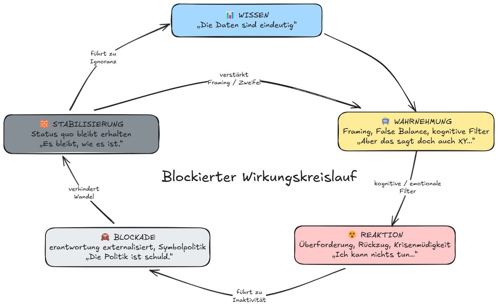

# 11.2 Systemmuster – Wissen → Wirkungslosigkeit

## 🎯 Zielsetzung

Dieses Modul beleuchtet ein zentrales Dilemma der Klimakommunikation und Transformationsforschung: Warum führt _mehr Wissen_ nicht automatisch zu _mehr Veränderung_? Welche strukturellen, kulturellen und systemischen Dynamiken verhindern die Wirksamkeit von Erkenntnissen?

## 📈 Lernziele

Teilnehmende können:

- das Spannungsfeld zwischen Erkenntnis und Wirkung erklären
- typische Muster der Entkopplung von Wissen und Handeln identifizieren
- strukturelle Blockaden benennen (z. B. institutionelle Trägheit, symbolische Politik)
- eigene Kommunikationsformen kritisch reflektieren

## ❓ Einstieg (Impulsfrage)

> Wenn „alle alles wissen“ – warum passiert so wenig?

Kurze Diskussion im Plenum, gesammelt auf Flipchart oder Whiteboard:

- Welche Arten von Wissen sind überhaupt gemeint?
- Wo liegen Hürden für Konsequenzen?

## 📥 Input-Elemente

- Ausschnitt aus „Die Schlinge“, z. B. aus Kapitel 5: _„Warum Wissen nicht reicht“_
- Matrix-Beispiel:
  _Wissen → kognitive Zustimmung → symbolisches Handeln → strukturelle Wirkungslosigkeit_
- Grafiken / Visuals zum „Verzögerungssystem“

## 🔄 Wirkungskreislauf mit Blockaden

_Abbildung: Klimawissen trifft auf Filter, Überforderung, Strukturblockaden – und verliert seine Wirkung. Der Kreislauf zeigt, wie Erkenntnis in Ohnmacht münden kann. Rückkopplungen stabilisieren den Status quo._

**So liest man die Grafik:**

- **📊 Wissen**: IPCC, Klimaberichte, wissenschaftliche Prognosen
- **📺 Wahrnehmung**: gefiltert durch Framing, False Balance, Krisenrauschen
- **😵 Emotionale Reaktion**: Überforderung, Rückzug, Dissonanzvermeidung
- **🙈 Handlungsblockade**: Politik symbolisiert statt verändert, Verantwortung wird abgeschoben
- **🧱 Stabilisierung**: Der Eindruck verfestigt sich – „Es bringt ja doch nichts“

👉 Der Rückpfeil zeigt: Diese Dynamik wirkt als **kreisförmiges Muster** – jede Blockade verstärkt den Eindruck, dass Wissen nicht hilft.

> **Didaktischer Hinweis:** Diese Darstellung kann als Diskussionsgrundlage im Unterricht, in Workshops oder der Erwachsenenbildung eingesetzt werden.

## 🛠 Arbeitsphase

**Gruppenarbeit:**

- Jede Gruppe erhält ein typisches Beispiel (z. B. IPCC-Bericht, Fridays for Future, EU-Klimaziele).
- Aufgabe: Wo endet der Wirksamkeitspfad? Warum?
- Ergebnisse auf einem Plakat strukturieren (Pfad: Erkenntnis → Handlung → Wirkung)

## 🪞 Reflexion

- Welche „Verkürzungen“ machen Kommunikation bequem, aber wirkungslos?
- In welchen Strukturen sind wir selbst Teil der Wirkungslosigkeit?
- Was heißt das für Bildungsarbeit oder Engagement?

## 📂 Materialien

- Auszüge aus „Die Schlinge“ (Kap. 5, ggf. Kap. 7.12)
- Handout: Wirksamkeits-Pfade (könnte als PDF separat bereitgestellt werden)
- Optional: Visualisierung als Poster/Slide

## 📥 Nutzung & Lizenz

Dieses Modul basiert auf dem Dossier **„Die Schlinge“** von Björn Böttle.\
Lizenz: [CC BY-SA 4.0](https://creativecommons.org/licenses/by-sa/4.0/) – Verwendung, Anpassung und Weitergabe ausdrücklich erlaubt, auch für Bildungs- und Weiterbildungszwecke.\
Namensnennung erforderlich. Änderungen müssen unter gleicher Lizenz erfolgen.

<Footer />
